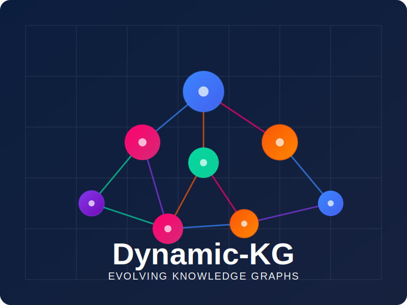

# Dynamic-KG 🧠🔄💫

> *"Because your AI system should be as dynamic as the world it operates in."*

<p align="center">
  
</p>

## What is Dynamic-KG? 🤔

Dynamic-KG is an experimental framework that creates intelligent digital twins of entities and their environments through evolving knowledge graphs. By combining the structural power of graph databases with the contextual understanding of large language models and the precision of retrieval-augmented generation (RAG), Dynamic-KG transforms how we process, analyze, and draw insights from complex, interconnected data.

Using financial risk assessment as our initial exemplar, we're demonstrating how this approach can revolutionize decision support systems across industries where context is king and relationships matter more than isolated data points.

## The Problem We're Tackling 🎯

Traditional decision support systems suffer from critical limitations:

- **Static Analysis** - They take snapshots of data without accounting for evolving contexts
- **Relational Blindness** - They miss the complex web of relationships between entities
- **Siloed Intelligence** - External knowledge remains disconnected from internal data
- **Expertise Bottlenecks** - Domain knowledge doesn't scale across organizations
- **Inconsistent Recommendations** - Different analysts reach different conclusions from the same data
- **Black-Box Reasoning** - The "why" behind recommendations remains opaque

These limitations lead to missed opportunities, unnecessary risks, and decisions based on incomplete understanding. The financial sector offers a perfect example: risk assessment processes often fail to incorporate the dynamic relationship between applicants and their market context, resulting in both false positives (approving bad risks) and false negatives (rejecting good opportunities).

## Our Approach: Living Digital Twins 🌟

Dynamic-KG introduces a fundamentally different paradigm:

1. **Living Digital Twins**: Knowledge graph representations that evolve in real-time as new information becomes available

2. **Context-Aware Intelligence**: Recommendations that consider not just the entity itself, but its position within a complex network of relationships

3. **Next Best Action Guidance**: Systems that don't just analyze data but suggest what information to gather next

<p align="center">
  
</p>

## Core Capabilities 💪

### 1. Dynamic Knowledge Graph Construction 🏗️
- Domain-specific ontologies that capture entity relationships
- Temporal tracking of changing connections and properties
- Confidence scoring with evidence attribution
- Automated graph enrichment from multiple sources

### 2. Multi-Source Intelligence Integration 🌐
- Structured data integration from internal systems
- Unstructured text analysis from documents and transcripts
- External API connectors for market and industry data
- Continuous learning from new interactions

### 3. Contextual Insight Generation 💬
- Evidence-based recommendations with explanation paths
- Anomaly detection across relationship networks
- Pattern recognition across similar entities
- Counterfactual analysis ("what if" scenarios)

### 4. Next Best Action Engine 🧩
- Context-aware question generation
- Information value calculation for optimal data gathering
- Adaptive decision paths based on new information
- Continuous model refinement from outcomes

## Applications Beyond Finance 🌍

While we're using financial risk assessment as our demonstration case, this approach has transformative potential across industries:

- **Healthcare**: Digital twins of patients that incorporate medical history, genetic factors, and treatment responses
- **Supply Chain**: Network models that predict disruptions and suggest mitigation strategies
- **Customer Experience**: Evolving customer profiles that recommend personalized engagement strategies
- **Research & Development**: Knowledge graphs connecting research findings, market needs, and development resources
- **Cybersecurity**: Threat models that evolve based on emerging attack patterns and organizational vulnerabilities

## Experiments We're Running 🧪

Our experimental roadmap includes:

### 1. Synthetic Entity Generator 🤖
Creating realistic synthetic data with:
- Domain-specific attribute patterns
- Relationship networks with realistic properties
- Temporal evolution patterns
- Embedded anomaly cases for testing

### 2. Knowledge Graph Evolution Simulator ⏱️
Visualizing and analyzing KG growth through:
- Timeline-based graph visualization
- Node/relationship confidence tracking
- Information source attribution
- Decision recommendation changes over time

### 3. External Knowledge Integration 📊
Testing integration mechanisms for:
- Document processing pipelines
- Public data API connectors
- Transcript analysis systems
- News and market intelligence feeds

### 4. Recommendation Engine Evaluation 📈
Measuring effectiveness through:
- Information gain quantification
- Path optimization techniques
- Counterfactual testing
- Human expert validation

## Technical Architecture 🏛️

Dynamic-KG is built with a modular architecture:

```
dynamic-kg/
├── data/                  # Data storage and synthetic generation
│   ├── raw/               # Raw source data 
│   ├── processed/         # Transformed data ready for ingestion
│   ├── synthetic/         # Synthetic data generation
│   └── external/          # External data source connectors
│
├── core/                  # Core system components
│   ├── knowledge_graph/   # Graph database operations
│   │   ├── ontology/      # Domain-specific schemas
│   │   ├── connectors/    # Database connection management
│   │   └── operations/    # Graph manipulation functions
│   │
│   ├── nlp/               # Natural language processing
│   │   ├── extractors/    # Entity and relation extraction
│   │   ├── analyzers/     # Text analysis components
│   │   └── generators/    # Text generation (questions, explanations)
│   │
│   ├── agents/            # Specialized AI agents
│   │   ├── planner/       # Strategy and coordination agents
│   │   ├── retriever/     # Information gathering agents
│   │   ├── reasoner/      # Analysis and inference agents
│   │   └── communicator/  # Output generation agents
│   │
│   └── processors/        # Data processing pipelines
│       ├── document/      # Document processing workflows
│       ├── conversation/  # Interaction processing
│       └── integration/   # Multi-source data integration
│
├── assessments/           # Assessment frameworks and outputs
│   ├── templates/         # Assessment type definitions
│   ├── outputs/           # Generated assessment results
│   └── evaluators/        # Assessment quality measurement
│
├── pages/                 # Streamlit application pages
│   ├── 01_entity_explorer.py
│   ├── 02_graph_visualizer.py
│   ├── 03_recommendation_engine.py
│   └── 04_assessment_builder.py
│
├── utils/                 # Shared utilities
│   ├── visualization/     # Visualization components
│   ├── metrics/           # Evaluation metrics
│   └── config/            # Configuration management
│
├── tests/                 # Unit and integration tests
├── app.py                 # Main Streamlit application
├── requirements.txt       # Project dependencies
└── README.md              # Project documentation
```

## Getting Started 🚀

```bash
# Clone the repository
git clone https://github.com/Kris-Nale314/Dynamic-KG.git
cd Dynamic-KG

# Set up virtual environment
python -m venv venv
source venv/bin/activate  # On Windows: venv\Scripts\activate

# Install dependencies
pip install -r requirements.txt

# Generate synthetic data
python -m core.processors.data_generator

# Run the Streamlit application
streamlit run app.py
```

## Why This Matters 💡

Dynamic-KG represents a fundamental shift in how we approach decision support systems by:

1. **Modeling complexity** rather than reducing it to simplistic features
2. **Embracing evolution** instead of relying on static snapshots
3. **Connecting knowledge sources** that traditionally remain siloed
4. **Providing transparent reasoning** that builds trust and understanding
5. **Learning continuously** from new information and outcomes

This framework demonstrates the potential of combining knowledge graphs, large language models, and retrieval-augmented generation into systems that truly understand the context in which they operate - a critical advancement for AI that needs to function in our complex, interconnected world.

## Contributing 🤝

We welcome contributions from data scientists, knowledge graph enthusiasts, domain experts, and anyone interested in building more contextually aware AI systems. See our [CONTRIBUTING.md](CONTRIBUTING.md) for guidelines.

## License 📄

This project is licensed under the MIT License - see the [LICENSE](LICENSE) file for details.

---

<p align="center">
  <em>Building intelligence that understands not just entities, but the worlds they exist in.</em>
</p>